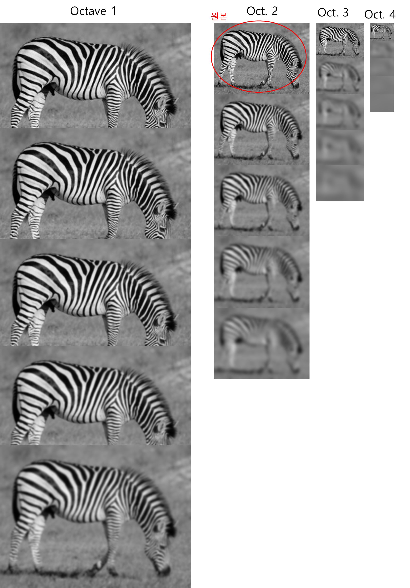

# tqdm

```python
number_list = list(range(100))
for x in tqdm(number_list):
  sleep(0.05)
print("Completed!")
```


```python
def train_fn(loader, model, optimizer, loss_fn, scaler):
    loop = tqdm(loader)
    for batch_idx, (data, targets) in enumerate(loop):
        data = data.to(device=DEVICE)
```



