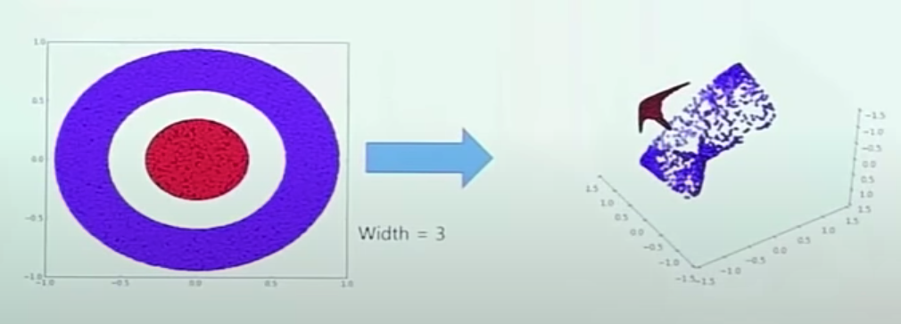

## Overlap Tile Strategy

- Each two tiles which are green boxes has split parts of single nuclei.
- And it is hard to guarantee that the tile that has a remainder part of the nucleus is adjacent to the current tile. -> This is what I guess
- It requires that left half and right half of the nuclei has to be classified as one single label, and it takes additional effort to make them have identical classification.

## Non-Linearlity

Without activation function, model is always linear function. Multiple layers' many nodes make non-linear architecture to make the data can be classified easilty

## Momentum

To optimize back propagation, 

RMSProop, Adam are all inspired by Momentum concept.

Gradient L(w) = [dL(w1)/ dw1. , ... ,      ]

## Batch

Mini-Batch Gradient Descent

- Training and updating based on batch.

Stochastic Gradient Descent

- Training and updating based on single data in batch.	
- Stochastic means probability. Training with entire datasets are not using probability concept. Meanwhile, training data with sampling can prevent model from being overfitted.
