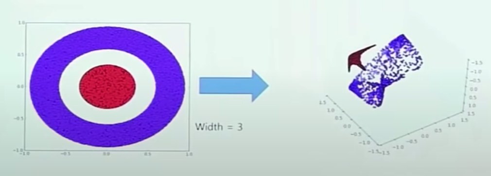

###  DICE Score

This is the score that measures the performance of the image segmentation accuracy. The more overlap area between output of the model and ground truth, it has higher score.
$$
Dice(𝐴,𝐵)=2|𝐴⋅𝐵|/|𝐴|+|𝐵|
$$

###  Overlap Tile Strategy

- Each two tiles which are green boxes has split parts of single nuclei.
- And it is hard to guarantee that the tile that has a remainder part of the nucleus is adjacent to the current tile. -> This is what I guess
- It requires that left half and right half of the nuclei has to be classified as one single label, and it takes additional effort to make them have identical classification.

###  Non-Linearlity

Without activation function, model is always linear function. Multiple layers' many nodes make non-linear architecture to make the data can be classified easilty

###  Momentum

To optimize back propagation, 

RMSProop, Adam are all inspired by Momentum concept.

Gradient L(w) = [dL(w1)/ dw1. , ... ,      ]

###  Batch

Mini-Batch Gradient Descent

- Training and updating based on batch.

Stochastic Gradient Descent

- Training and updating based on single data in batch.	
- Stochastic means probability. Training with entire datasets are not using probability concept. Meanwhile, training data with sampling can prevent model from being overfitted.

###  Learning Rate Decay

In order to converge to the lowest point of the graph.

method

 - Step decay
   - Starting with big learning rate. 
   - Changing learning rate after certain epoch.
 - Exponential decay
   - Gamma = e^-t 
     - t is round. t is going to converge as round goes on.
 - Cosine decay

###  Activation Function

Why it is called non-inearlity? And how it helps to boost deep learning performance?

Sigmoid, tanh, ReLU, Leaky ReLU, Mahout, ELU

There should be some red and blue plotting points that can't be separated by linear line. 

There datasets are viewed with more deeper dimension so that they could be classified by line.

Non-linearlity makes datasets more in deep dimension.

###  Classification

Probability vector should be from 0 to 1.

Z = [z1,z2,z3] = [1.6, 0.55, 0.98]

softmax function

A = [a1, a2, a3] = [0.51, 0.18, 0.31]

###  Fully-Connected Layer is not usually used in initial phase

- Because it requires too much computation.
- There are too many parameters regarding weights and bias.

###  Convolutional Layer

Image: 224 X 224 X 3

Filter: 5 X 5 X 3
$$
w^T *x + b
$$
W is weight and bias is also added(bias is a single scalar value).

Outcome: 220 X 220 X 1 (Activation Map) 

The outcome passed by filter is one single value, rather than three channel outcomes. 

And the elements in the filters are weight. Ex) filter's shape is [5, 5, 3] and the each element in the filter (5 * 5 * 3 = 75 ) is all weight.

With Image: 224 X 224 X 3, Using 6 filters (5 X 5 X 3) the convolutional layer can have outcome as 220 X 220 X 6 activation maps.

###  Max Pooling could replace convolution?

In heuristic, there are some certain layers that don't affect performance and also can't be trained. In order to not to use the parameters for those layers, model can use pooling that don't have parameters so that it don't have redundant parameters.

### Activation function in CNN

Activation function is applied to each pixel that has been passed through filters.

###  Cross-Entropy Function

Cross Entropy Functions tries to make Lower the gap between label and predicted vector.

Label (p) = (1,0,0,0,0)

Prediction (q) = (0.6, 0.3, 0.02, 0.03, 0.05)
$$
-Σp_i*logq_i
$$
It is also called Kullback- Leibler Divergence(KL divergence)
$$
-Σp_i*logp_i/q_i
$$

Using Cross Entropy and KL divergence are equal.

###  Lightweight Networks

Decompose the filter. The idea is inspired by the idea that having kernels for each channel is too redundant.

Ex) 7 X 7 X 30 ------- decompose -------> 7 X 7 X 1 (depth-wise convolution) + 1 X 1 X 7 (point-wise convolution)

Decompose the filter into two different filters.

Total number of parameters: (7 X 7 X 1) X M + (1 X 1 X 7) X N

#### Mobile-Net

The purpose of Mobile-Net.

Efficiency = memory + FLOPS

Memory and FLOPS are independent factors. Efficiency is defined like this in computer science field.

#### Mobile-Net - ReLU6

ReLU has the 1 slope when x > 0, which means that y keeps growing when x > 0.

In terms of signal, it has chance to have too big signal when x > 0.

##### Efficient Net

Engineers that developed Efficient-Net found the optimal combination of the a, b and c

a* b^2 * c^2 = 2 

a, b and c are the number of scaling how much it will expand the width of images and layers.
