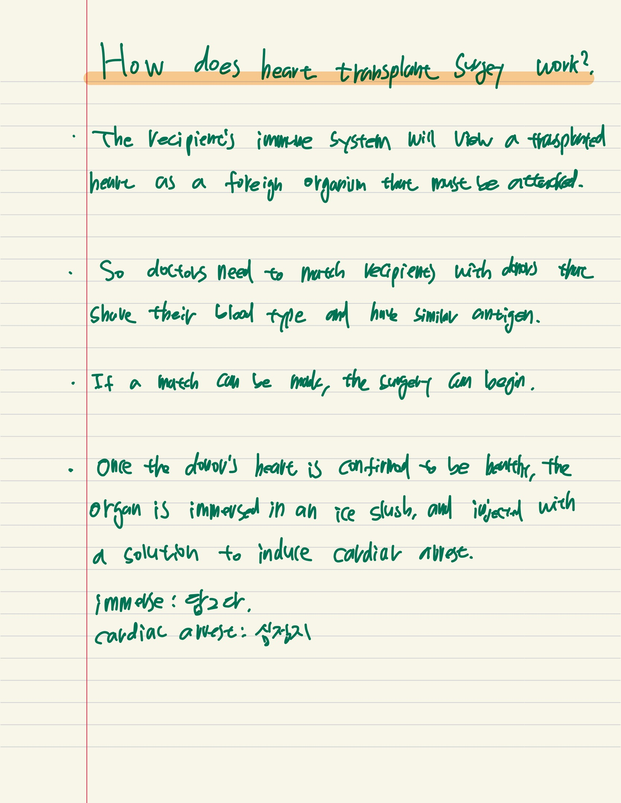
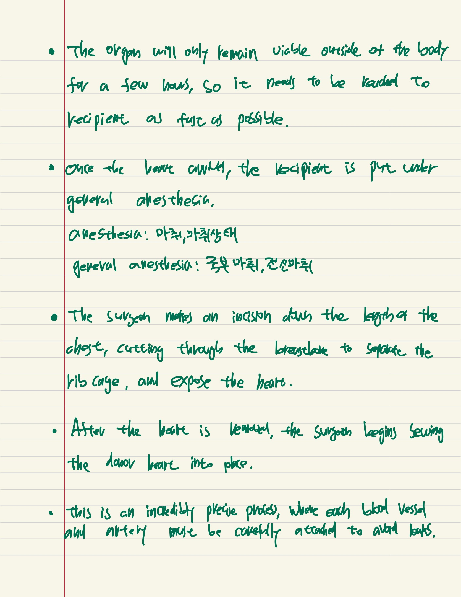
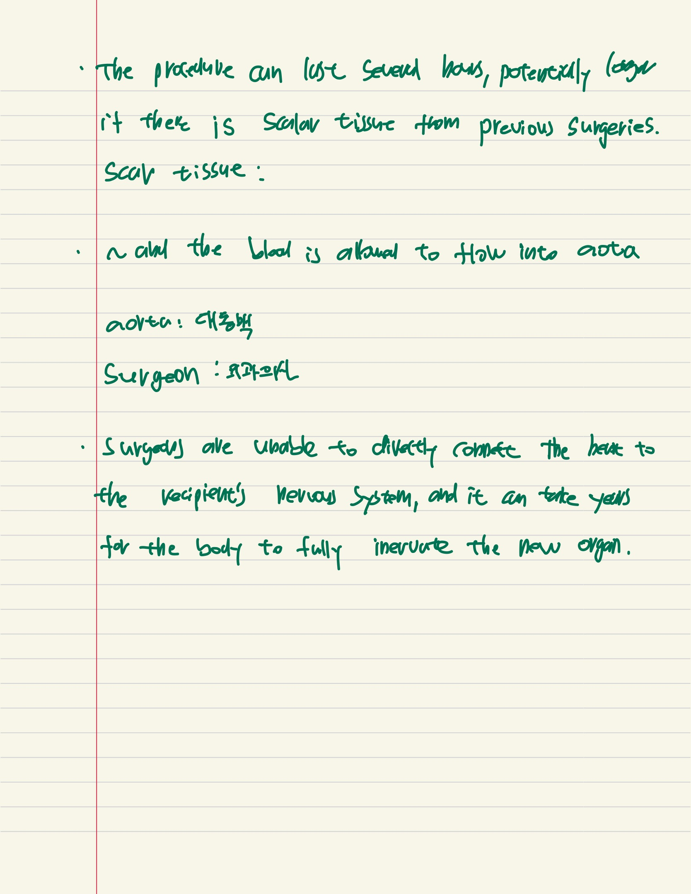

### The biggest mistakes in mapmaking history

The video says the transition of the world map and how cartographers in many different countries over a long period have depicted the world map .

##### words

Glaringly 
Vogue 
Veer 
Cartographer
Take a stab(Try) 
Astray (adjective-lead a person astray) 
flemish (relating to Flanders, its people, or their languages) 
Terra incognita
Eradicate
Scrawl
Cosmography
Slew of

 

The book of maps included a world map based on Idrisi's own travel and interview with other traders and travelers.

 

He correctly depicted the world as a flattened sphere, and thought Asia, Europe and North Africa all the way around it.

###  Why are eating disorders so hard to treat?

psychiatric / relating to mental illness or its treatment. 정신의학의

Psychological / 심리적인, relating to psychology, affecting or arising in the mind.

Anorexia _ an eating disorder characterized by restriction of food intake leading to low body weight, typically accompanied by intense fear of gaining weight and disrupted perception of body weight and image.

Binge _ indulge in activity, especially in eating, drinking or taking drugs _ 마구먹는것, 과식하다

purge _ rid of unwanted quality, condition and feeling _ 정화하다, 장에 하제를 써서 제거하다.
 ex) Bob had helped Tom purge guilty feeling that had hunted him.

anemia _ a condition marked by a deficiency of red blood cells and hemoglobin in the blood _ 빈혈, 무기력

Intervention _

Psychotherapy _ The treatment of mental conditions by verbal communication and interaction_

There likely isn't a single cause, but a combination of genetic and environmental risk factors that contribute.

Osteoporosis _ A medical condition in which the bones become brittle and fragile from loss of tissue _ 골다공증

nervosity 

Self-perception _  자기인식

Ex) Most people who experience them are very severely critical of themselves and report many self-perceived flaws.

Bulimia 과식

Stigma _ A mark of disgrace associated with a particular circumstance, quality or person _ 치욕, 오명

Assimilate _ take in and understand fully _ (사고, 습관, 사고방식) 등에맞게 하다, 닮게 하다

erode _ wear away _ 서서히 파괴하다

But education for individuals, families and communities can help erode the stigma and improve access to treatment. 

###  How does heart transplant work? 

June 8 wed

