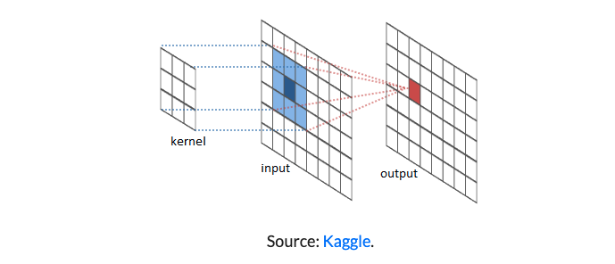

### GaussianBlur()

cv.GaussianBlur(img, (5,5) , cv.BORDER_DEFAULT)

##### <br>Blurring an image

The pixel is reduced to follow the average value of the pixels that is covered by the kernel size. 




### <br>Canny()

It is used to detect edges in an image.

```python
canny = cv.Canny(blur, 125, 175)
# 125 is the lower threshold value in Hysteresis Thresholding
# 175 is the upper threshold value in Hysteresis Thresholding
cv.imshow('canny', canny)
cv.waitKeyEx(0)
```

### <br>resize()

```python
resized = cv.resize(img, (500,500), interploation = cv.INTER_AREA)
# interploation = cv.INTER_AREA This makes the image get resized smaller than original dimension.
cv.imshow(resized)
```

### <br>Cropping Image

```python
cropped = img[50:200, 200:400]
```

