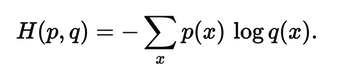

### Cross Entropy

From deep learning, cross entropy loss is used to have difference between probability distribution between predicted outcomes and real labels.

- Real label is expressed as one-hot-encoding such as

Class A : 0 / Class B : 1 / Class C : 0


- Machine learning outcome is 

Class A : 0.228 / Class B : 0.619 / Class C : 0.153


The Cross Entropy to get the difference between label and predicted value is:




H = - ( 0.0 * ln(0.228) + 1.0 * ln(0.619) + 0.0 * ln(0.153) )

The model is being trained to lower the loss between predicted value and real label.

Each two tiles which are green boxes has split parts of single nuclei


From pytorch

```python
outputs = outputs.reshape(batch_size * width_out * height_out, 2)
labels = labels.reshape(batch_size * width_out * height_out)
loss = criterion(outputs, labels)
```


### <br>Entropy

Minimum amount of information to express information.


 
