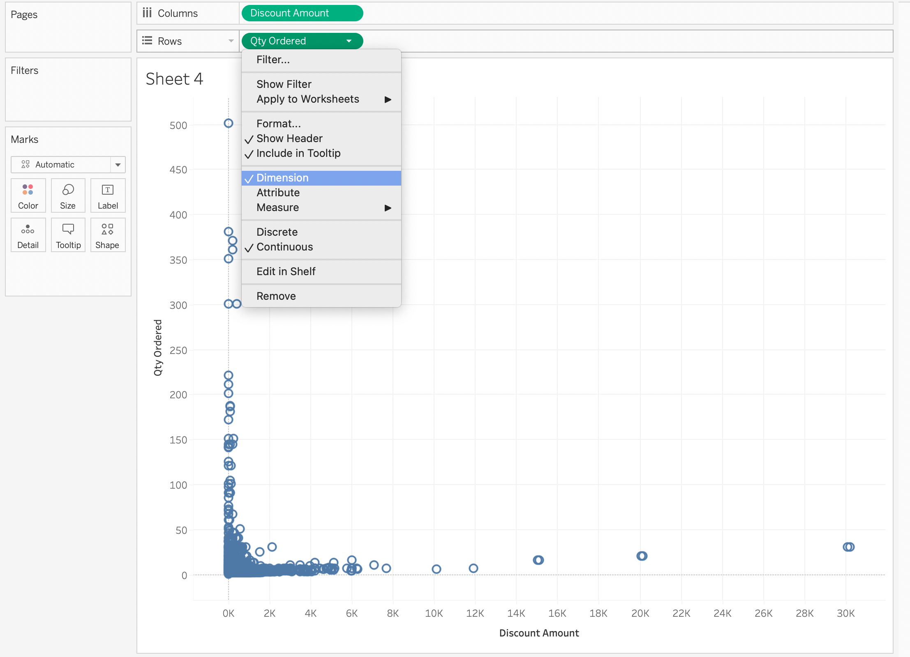

##### Dimension

- Dimensions includes qualitative values such as geographical data or any categorical data. It can be used to categorize and segment the details. It can also affect the level of detail in the view.
- Measures include numeric and quantitative values. It can be aggregated.

