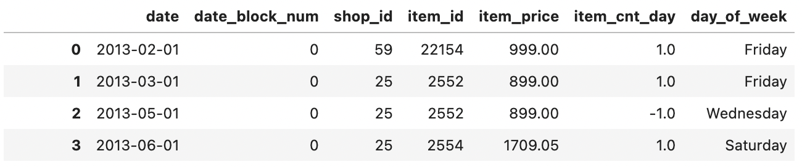

##### set_index()

It replaces the index using the exiting column. Access to the row is available through loc and is accessible through the order.

```python
train_data
train_data.set_index('item_id', drop='false') # if there is drop: then another set_index function drops the previous index columns
train_data.loc[0]

# date              2013-02-01 00:00:00
# date_block_num                      0
# shop_id                            59
# item_id                         22154
# item_price                      999.0
# item_cnt_day                      1.0
# day_of_week                    Friday
# Name: 0, dtype: object
```



##### Reset_index()

It discards the existing index, such as being given after groupby(), and resets the index of the Data Frame. It ranges from 0 to length of data as index.

```python
grouped  = pd.DataFrame(train_data.groupby(['shop_id', 'date_block_num'])['item_cnt_day'].sum().reset_index() )
grouped2 = pd.DataFrame(train_data.groupby(['shop_id', 'date_block_num'])['item_cnt_day'].sum())
```


##### value_counts()

This is the function for Pandas series. It returns the series with the specified values. 

```python
# 1st Example
dataFrame['item_category_name'].value_counts().plot(kind='bar',color='orange', figsize=(20,8))


# 2nd Example: It finds and counts the unique values.
index = pd.Index([3, 1, 2, 3, 4, np.nan])
index.value_counts()
# 3.0    2
# 1.0    1
# 2.0    1
# 4.0    1
```


##### Filtering DataFrame

###### Logical Operators

```python
train_data[train_data["shop_id"]==0].head()
```


###### Multiple Logical Operators

```python
train_data[ (train_data["shop_id"] == 2) & (train_data["item_cnt_day"]!=1) ].head(60)
```


###### ISIN

```python
names_filter = ['John','Catlin','Mike']
df[df.name.isin(names_filter)]
```


##### Reference:

https://towardsdatascience.com/8-ways-to-filter-pandas-dataframes-d34ba585c1b8


##### pd_todatetime()

When css files are imported, it is very hard to read data time object as date format and usually it is just read as string type. Thus, pd_todatetime() helps convey string to Python Date Time format.


```python

```


##### Series.dt.strftime()

It is used to convert specified date format. The format is specified by date_format.

```python
sales_per_month = sales_train_df.groupby(sales_train_df['date'].dt.strftime('%B'))['item_cnt_day'].sum()
# group sold item cou
```


##### group_by()

It groups the rows with specified values.

```python
sales_per_month = train_data.groupby(train_data['date'].dt.strftime('%B'))['item_cnt_day'].sum()
```


##### Adding new column in existing Dataframe

```python
days = ['Monday', 'Monday', 'Tuesday', 'Thursday', 'Friday', 'Wednesday', 'Tuesday']
train_data['day_of_week'] = days # train_data did't have day_of_week column, but now it has days_of_week
```


