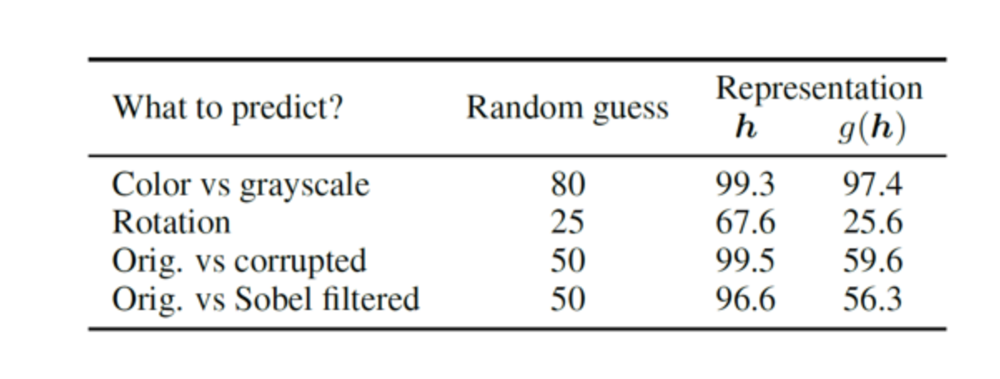

### 

### Simple Framework for Contrastive Leargnin of Visual Representations is a research that provides the light frameworks of the contrastive learning. 


Thought the pretext task, the model is trained to predict what tasks were performed to the images. However it had limitation that the model is good at answering pretext task rather than extracting the images representation that is ultimate purpose of the area.


To address the issue, SimCLR applies contrastive learning.

<br>Contrastive learning is literally making the model be trained to conclude the close interval between similar images and har interval between different images. Similar images mean same images but went through different image augmentation, and different images mean that different images. 


### <br>Encoder

ResNET is used as encoder.


### <br>Data Augementation

Considering the characteristic of the ImageNet, crop and resize are done as default augmentation.


### <br>Projection Head

<br>Output from the projection heads have a great help in training performance for the model, but the outputs from projection head itself doesn't have a g great representation of the images.



Likewise the experiment above, the representation from g(h) (projection head) has lower representation than h function. The paper claims that the features from the image s are closed at the projection head phrase.

### <br>Performance Evaluation

- Freezing encoder and add classification 
- Fine tuning with learnable parameters in encoder
- Transfer learning with different datasets

### <br>loss function

The papers validates why NT-Xent is better than other previous loss functions, NT-Logistic and Margin triplet loss.<br>


#### NT-Xent Loss Function

```python
# NT-Xent Loss Function -> Using two batch size for convenience.

```

