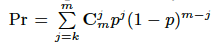
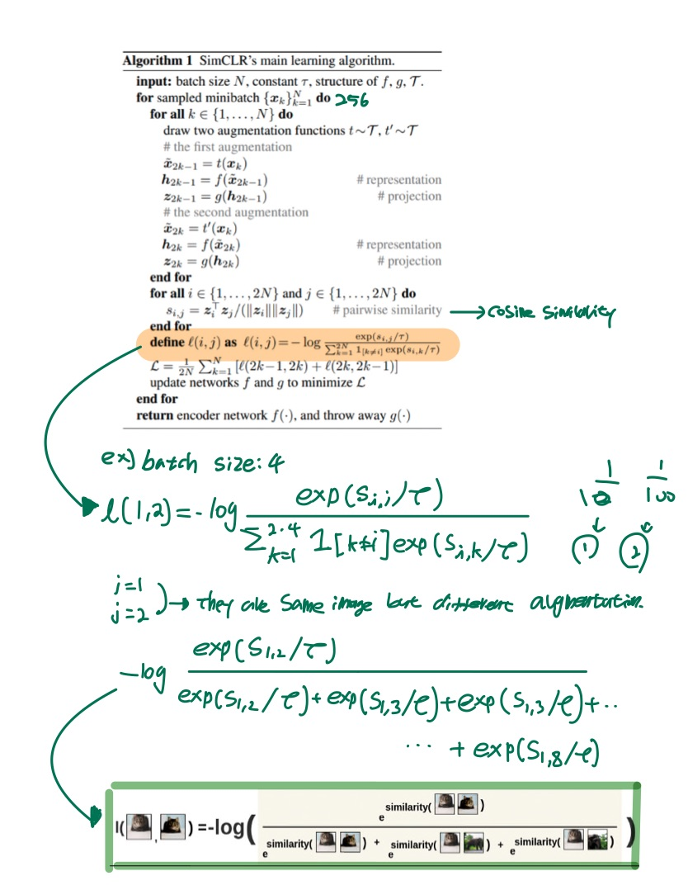

#### Abstract

SimCLR which is one of the self-supervised learning mouthed has issue in inefficiency to train. The paper states that the two main issues in training the self supervised learning which one is under-clustering and the other is over-clustering. Under clustering means that the model can not be trained to discriminate the objects when the negative sample pairs are insufficient, in contrast over-clustering implies that forces model to classify the objects which is the same class in different clusters.

- Figure for under-clustering and over-clustering

------

#### Contributions

- Analyzing the existing attribute that results in under-clustering and over-clustering.
- Truncated-Triplet Loss Function is proposed to address under-clustering and over-clustering issues. The loss function is guaranteed by Bernoulli distribution model.
- Novel SSL framework with truncated-Triplet Loss function improves learning efficiency and state-of-the-art performance in several large-scale benchmarks.

------

#### Introduction

##### Under-Clustering

- Due to the lack of negative pairs of datasets, model has low learning efficiency because it can't find the dissimilarity between inter class objects. In other words,  different animal images are classified in the same cluster.

##### Over-Clustering

- Due to the excessive of the negative pairs of datasets, model has low learning efficiency because it finds the excessive dissimilarity between intra class objects, so that it classifies the same types of animal as different cluster. In other words, brown bear and American black bear which are all bears are classified as different types of animals.

##### Truncated Triplet Loss Function

- Triplet Loss Function

##### Bernoulli distribution Model

P is probability that negative sample and query belong to the same class.

C is combination

