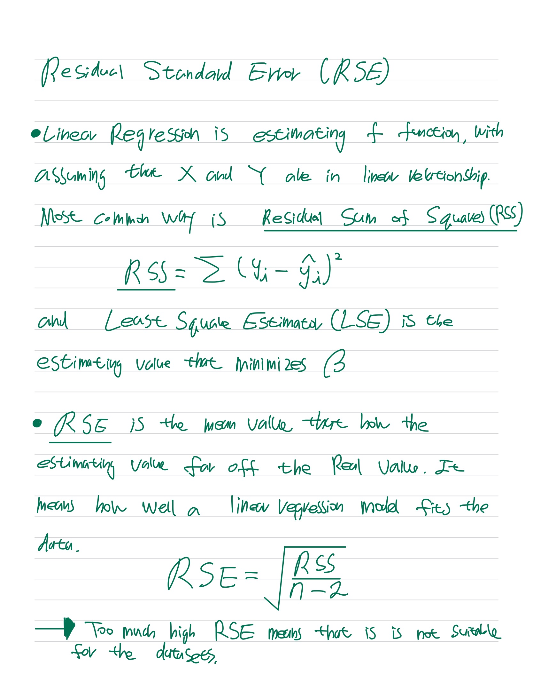
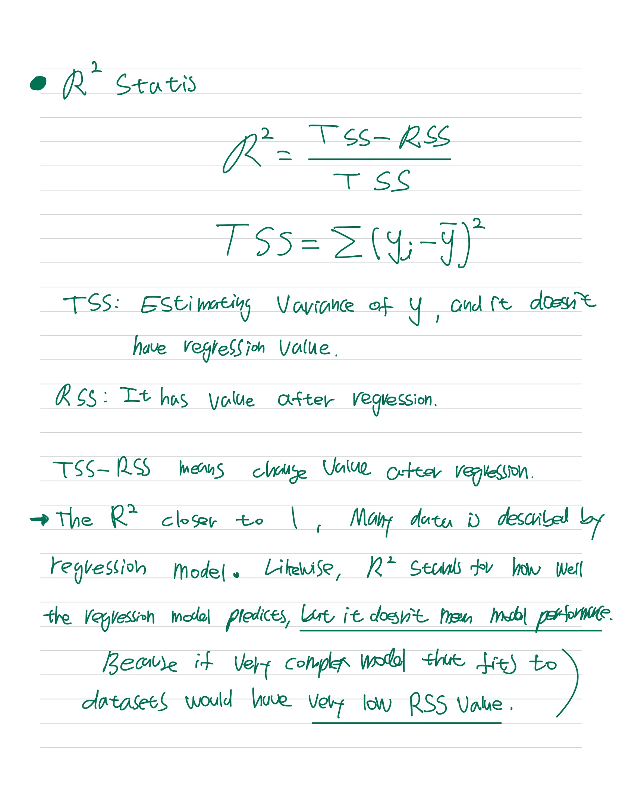

##### Anova

Anova is the variance analysis, that analyze the relationship between variance of dependent variables and variance of independent variables.

##### Residual Sum of Squares (RSS)

It is the variance of the interval that is not explained by the regression model.
$$
RSS = \sum({y_i}-\hat{y_i})^2
$$

##### Residual Standard Error (RSE)

It is the standard deviation of the residuals.

$$
RSE = \sqrt{\frac{1}{n-p-1}*RSS}
$$

