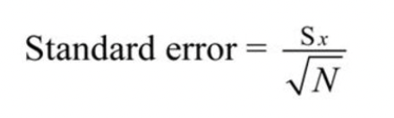

###### Linear Regression is very strong regression model that can predict the estimator value based on given datasets. From R, there is function  ln() that can create linear regression model and summary() function provides the performance about the linear regression model. From this article, we are going to look through the linear regression model evaluation methodology combing with R summary() function.


```R
library(MASS)
library(ISLR)
names(Boston)

# multiple linear regression
lm.fit = lm(medv~lstat+age, data=Boston)
summary(lm.fit)
```

Output:

```R
# Call:
# lm(formula = medv ~ lstat + age, data = Boston)

# Residuals:
#    Min      1Q  Median      3Q     Max 
# -15.981  -3.978  -1.283   1.968  23.158 

# Coefficients:
#            Estimate Std. Error t value Pr(>|t|)    
# (Intercept) 33.22276    0.73085  45.458  < 2e-16 ***
# lstat       -1.03207    0.04819 -21.416  < 2e-16 ***
# age          0.03454    0.01223   2.826  0.00491 ** 
# ---
# Signif. codes:  0 ‘***’ 0.001 ‘**’ 0.01 ‘*’ 0.05 ‘.’ 0.1 ‘ ’ 1

# Residual standard error: 6.173 on 503 degrees of freedom
# Multiple R-squared:  0.5513,	Adjusted R-squared:  0.5495 
# F-statistic:   309 on 2 and 503 DF,  p-value: < 2.2e-16
```


1. ##### Residuals

Residual means that the difference between the actual responses and predicted values. If the residuals are skewed then it means that predictor more falls off one side than the other side.


2. ##### Coefficient: Estimate

It could be thought of the intercept and slope. 

2. ##### Coefficient: Standard Error

We use sample from the population to do the experiment and convenience. How can we know that the sample properly represents the population? Standard Error can give insight about that. Standard Error means that Standard deviation of group of sample mean. The formula of the Standard Error is like below.



​															<Standard deviation of Population / square root of number of samples>

Recap: Standard Error is the standard deviation between mean of samples. In case of regression, it measures the average amount that the coefficient estimates vary from the average value of response variable. 

2. ##### Coefficient: t-value

The coefficient t-value is a measure of how many standard deviations our coefficient estimate is far away from 0. Large Standard deviation indicates that we could reject null hypothesis, so we could declare a relationship between speed and distance exist. In our example above, the t-statistic values are far away from zero and are large relatives to the standard error, which could indicate a relationship exists. In general, t-values are used to compute p-values as well.


3. ##### Coefficient: Pr

Small P-value is indication that we can reject the null hypothesis, that we can conclude relationship between predictor and response are valid. Typically cut-off point of P-Value is 5%. In the summary above, three asterisks describes that it is low P-value which we can reject null hypothesis.


4. ##### Residual Standard Error

It means how well the linear regression model fits to the actual datasets. The lower RSE score means that it is better accuracy than the regression model with higher RSE. Also, the high RSE stands for the datasets are spread out from the fitted regression line. 
$$
Residual Standard Error = √Σ(y – ŷ)2/df
$$
y: Datasets

ŷ: predicted values by the predictor

df: Degree of Freedom: Total number of observations - Total number of model parameters -1

​		From the Residual Standard Error output, we can see that the RSE score is 6.173. It says that regression model estimates 'medv' with an average error of 6.173


5. ##### R-Squared

   The R-Squared score gets higher as more features exist, so it is not appropriate to compare R-Squared score of linear regression model with high-order polynomial model. And even the non-significant features are added the R-Squared score increases because of the increase of number of features.


$$
R^2 = \frac{SSE}{SST} = 1 - \frac{SSR}{SST}
$$

​		As it specifies, the formula involves SSE, SST and SSR. Thus, it is necessary to know the meaning of these three terms. 

###### References:

https://feliperego.github.io/blog/2015/10/23/Interpreting-Model-Output-In-R

